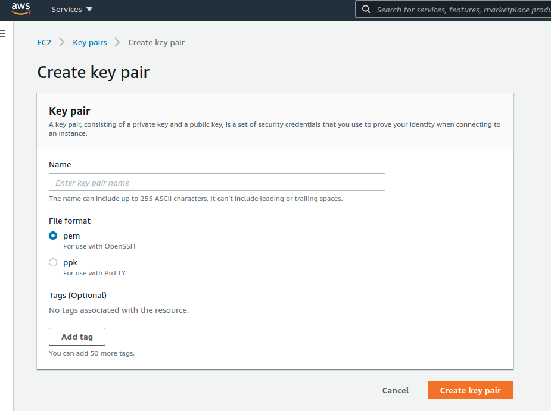

# easy-nuxt-resume

This project is based on the [ResuMe project](https://github.com/ivangreve) made by [Iván Greve](https://github.com/ivangreve).

This provides an **easy, 100% free** (for up to 1 year) way to launch your own web resume, making use of Iván's VueJs [template](https://ivangreve.com/).

[Amazon Web Services (AWS) free tier](https://aws.amazon.com/free/) enables this.

You'll use a **AWS CloudFormation infrastructure-as-code (IAC)** template that automates your free server allocation, and almost all the necessary setup steps.

## Pre-Requisite Knowledge

In order to use this project, you don't need to know anything about VueJS, AWS, or any web server configuration. It's all either automated or explained here, below.

You need know how to connect via SSH to a remote machine. You'll need to edit 1 text file, to customize your resume info, using a terminal.

## Pre-steps
### AWS account
You need to have your own (free) Amazon Web Services (AWS) account. You can find steps you need to follow to create your account [here](https://aws.amazon.com/premiumsupport/knowledge-center/create-and-activate-aws-account/).

Once your account is ready, **[log into your AWS console](https://console.aws.amazon.com/console/home) .**

### AWS Availability Zone

Choose your nearest **'Availability Zone'**. 

AWS is a public cloud spread throughout multiple regions around the world. You can **choose the location where you'll provision resources**. On the top right, next to 'Support', you'll find a menu where you can switch between these zones. Choose one that is close to you: 

### SSH- Key Pair

Next, you'll need to **set up your own key pair** (which is free), so that later you will be able to securely connect (via SSH), to the free server that you will allocate. On the top bar, left side, click on services. Then, find the **EC2** service in the list. Click on **EC2**:

On the left panel, under **Network & Security**, click on **Key Pairs**: 

On the top right, click on **Create key pair**. Pick a name for your key pair, and choose the format that suits you best (I picked *pem*, as I'm using OpenSSH on Ubuntu) Then, click **Create key pair**, to generate it, and download it to your computer.

## Launching your server
### Overview
All of the setup is automated! You will use **AWS Cloudformation**. You'll be uploading a template file to Cloudformation, describing our infrastructure. CloudFormation will take care of everything, and output essential info. It will create an AWS EC2 small virtual machine (which is free, for up to 1 year).

### Launching the Cloudformation stack
On AWS, click on the top search bar, and look for CloudFormation:

Click on **Create stack**, on the right:

On **Prerequisite - Prepare template**, choose **Template is ready**.

On **Specify template**, choose **Upload a template file**, and click on **Choose file**. Use the file *easy-resume.yaml*, from this project. Then, click **Next**:

**Stack name** - Pick whatever stack name you want, this is irrelevant. 

**InstanceType** - **t2.micro**, which is free. (I've left another option (t2.nano) in case you're already using your free instance for something else)

**KeyName** - click the dropdown list. The Key Pair you had created in the pre-steps should appear here. Select it.

**PageTitle** - This will be the resume page's title. You can put in your first + last name, or whatever else you'd like to.

**SSHLocation** - This is optional. If you want to be able to attempt an SSH connection from anywhere, leave it as 0.0.0.0/0 (you still need the Key Pair to be allowed in!). If you want to limit connection attempts to your computer only, then insert your own current IP address here, with /32 at the end for a single address (like 1.2.3.4/32).

Click **Next**

No need to change anything in **Configure stack options** or **Advanced options**, you can click **Next**:

No need to change anything the **Review page**, you can click **Create stack**:

By hitting the refresh button on the right, you can track CloudFormation's resource allocation as it happens:

It should take less than 1 minute, and your stack will be up and running:

Our virtual machine is now running! But, **it will take another 5 minutes** before all the necessary software is automatically installed in it (we only have 1vCPU!!! :smiley:), and the web resume becomes accessible!

Give it 5 minutes or so, and then click in the **Outputs** tab: 

Click on the public DNS name, and you should see Iván's original template running:

### Editing the resume info

This is the last step, as you'll customize the actual resume page...

#### SSH Connection
In the **Outputs** tab, you could also find the virtual machine's public IP address.

You can now connect to it, via **SSH**. For example, using a Linux-based terminal, or MacOS, open a terminal in the location where you previously downloaded the key file, in your computer:

- `ssh -i my_key_file.pem ec2-user@public_ip_adress`

#### Editing the resume
Navigate to where the resume info is stored:

- `cd /home/ec2-user/nuxt-resume/locales/`

Edit the resume, by opening *en.json* file and substituting the fields' values, then save the file. 

We can now regenerate the resume, by going to the ec2-user home:

- `cd`

And running a bash script:

- `./update_cv_restart.sh`

And the page should have refreshed with the new info. You can close the SSH connection.

### Extra: Adding secondary languages

If you'd like to configure multiple language support, and different versions of your resume, you can follow [Iván's guide, language section](https://github.com/ivangreve/nuxt-resume/blob/master/README.md#configuration-).

## Stopping and deallocating

Stopping and deallocating what you've created is very simple, thanks to Cloudformation.

This means that there are no loose ends that we can forget, and be charged for in the future, (in this case, that would only happen if it was left allocated beyond 1 year).

We'll simply delete the stack we've created before:

Once again, **[log into your AWS console](https://console.aws.amazon.com/console/home) .**

Click on the top search bar, and look for CloudFormation:

Select your stack, and click **Delete**:

Then, confirm the deletion prompt.

